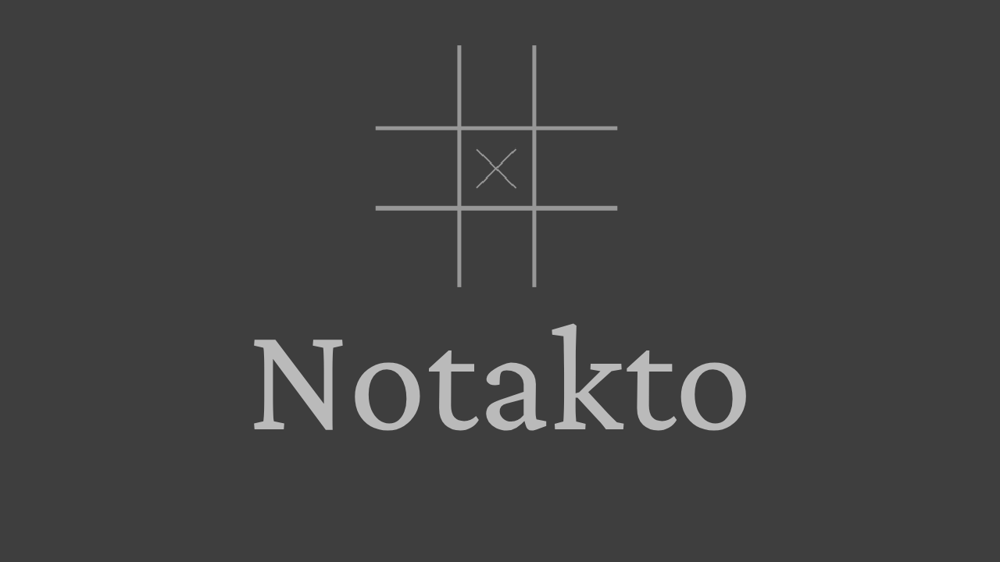

## What is Notakto?

[Notakto](https://en.wikipedia.org/wiki/Notakto) is a variant of tic-tac-toe in which both players play using 'crosses' as their markers across multiple tic-tac-toe boards. Three crosses in a row on any board will 'kill' it, meaning that the board can no longer be played on. When there is only one board remaining, the player who kills it is considered the loser, meaning that to win you have to get yourself in a position where you force the other person to get three-in-a-row on the final board. It is still a solveable game like regular tic-tac-toe, but the stratagies involve enough effort that you will probably not find many people who can figure them out on their own.

This project was made in tandem with its associated blog post, [read it here!](https://aas.sh/blog/notakto-a-haskell-game-with-apecs-and-raylib/)

## How to run the game

The [Nix](https://nixos.org/) language has been used to develop and build this project. All you need to do is use `nix run` and everything else should be handled for you. Windows users, beware.

## Playing the game

* The game pits the **Red** player against the **Blue** player
* There are 3 boards (customisable in code)
* Aim and left-click to place a cross
* Getting three in a row 'kills' a board; no more moves can be made on it
* Killing the last board results in the current player losing the game
* Use left-click to restart the game
